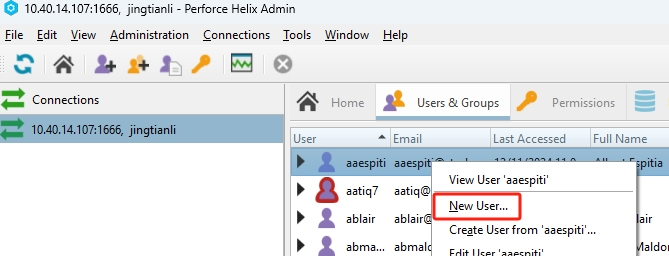
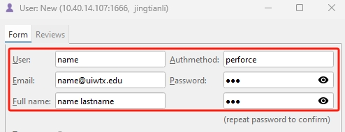
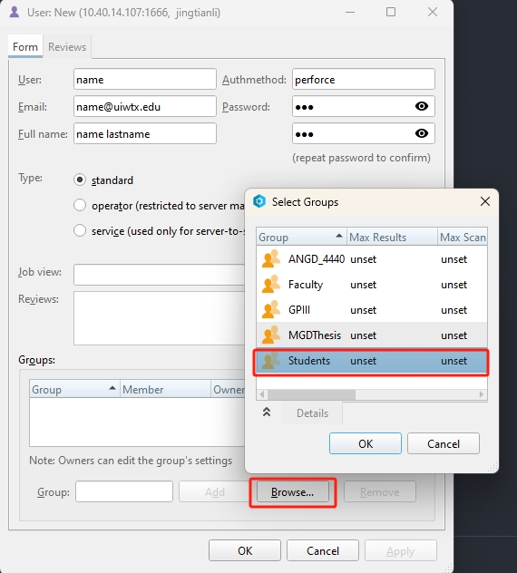
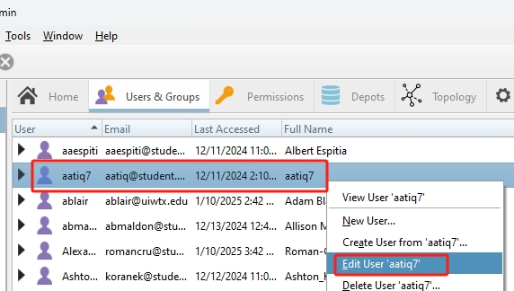
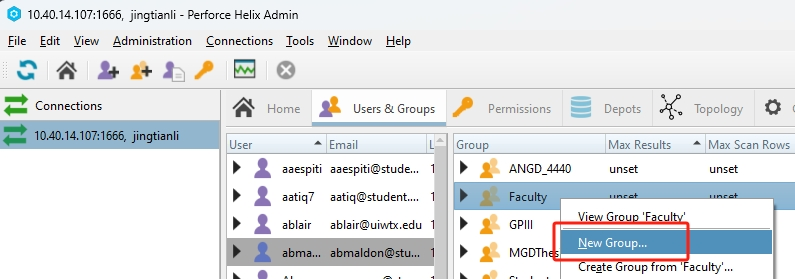
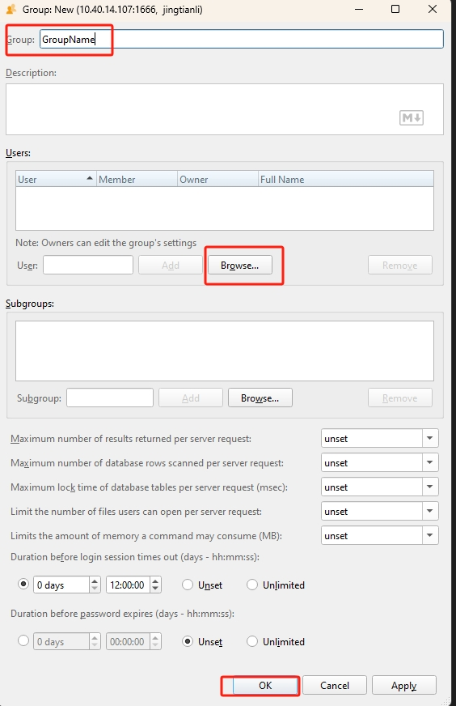
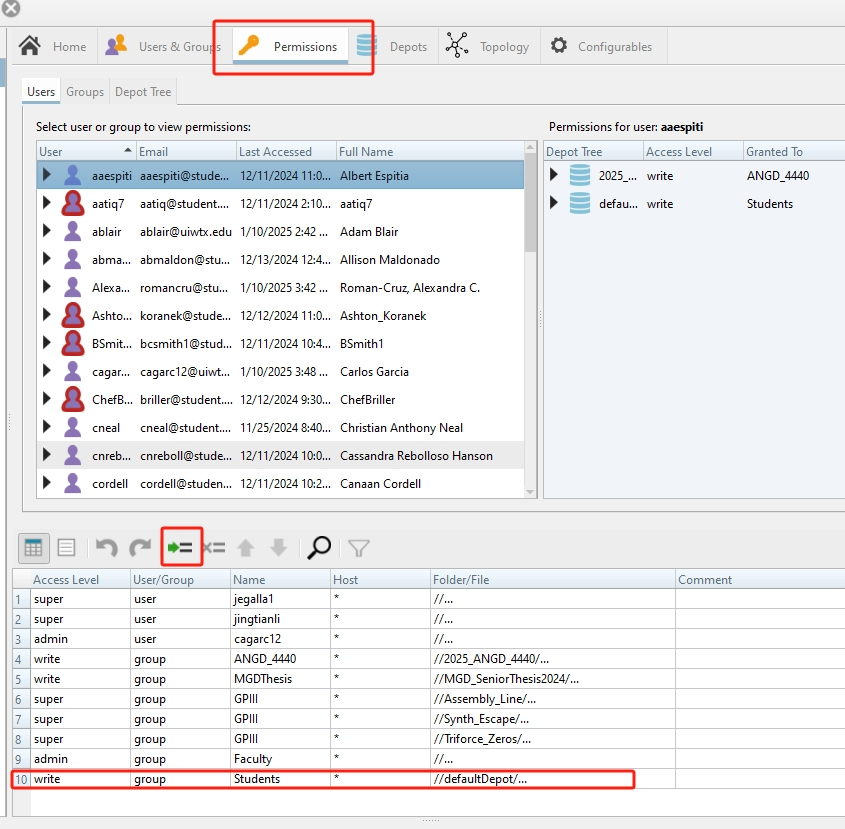
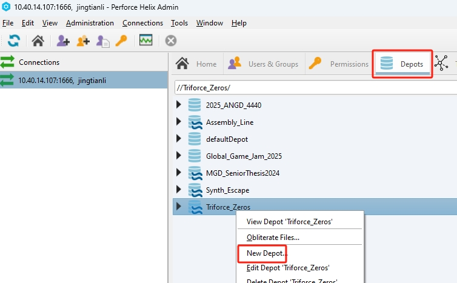
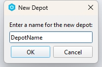
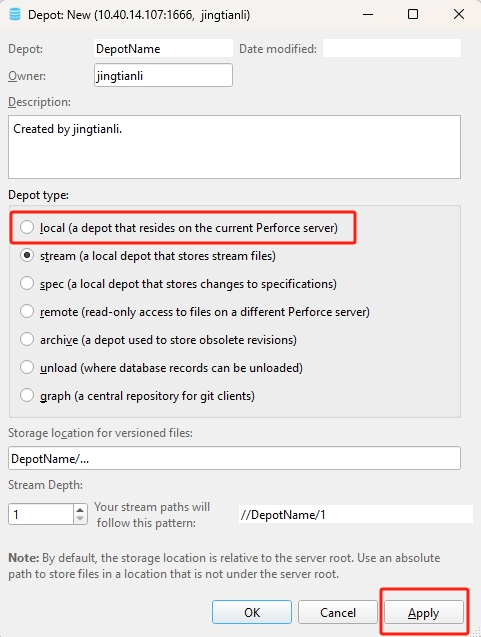

# Admin the Server

Some admin tasks are easier with the [CLI](AdminConsole.md) tools.

## Users

* To add a User, go to the ```Users & Groups``` tab, and right click on any of the users under the users list, and select ```New User...```



* Make sure ```User```, ```Authmethod```, ```Email```, ```Password``` and ```Full name``` are all filled:



* make sure to add a group to the user by Clicking the ```Browser...``` button under the ```Group:``` settings, pick one. For Students, use the Students group.



* You can also right click on any user and select ```Edit User 'user name'``` to edit them. to edit them, a similar window like the create user window will pop up, alowing you to change their settings like group.



## Group

Users under the same group share the pemission settings of that group. For example, the ```Faculty``` group contains the faculty users, and have ```Admin``` access to the entire Server, the can also create/delete users and depots. The ```Student``` group only has the ```write``` access of the ```defaultDepot``` depot on the server, they do not have acess to other depots, and they can't create depot or accounts.

* To make a group, right next to the ```users``` list, there is the ```groups``` list. Right click on any of the groups in the list and select ```New Group``` to make a new one.



* Under ```Group```, type in the new group name. Click on the ```Browse...``` button to select which users are to be assigned to the new group. And then click on ok to finish the group creation.



* You can right click on a group and do the edit or delete just like how you can edit and delete a user.

## Permission
* After a ```Group``` or ```User``` is created, you should set their Permissions, Under the ```Permissions``` tab, the list on the top allows you to view the permissions of each user and group. The table at the bottom allows you configure their permission.

Click on the ```Insert Line``` button  allows you to add a new Configuration. 



The settings you can configre are:

|   Settings         |  Description                                                                                    |
|--------------------|-------------------------------------------------------------------------------------------------|
| Access Level       | Level of access you want to give the user or group                                              |
| User/Group         | Do you want to configure the access level for a User or a Group, pick one of the 2              | 
|Name                | the User or Group name you want to configure access                                             |
|Host                | List of computers that has access to the server, a * means any machine from any where can access|
|Foder/File          | What folders(Depots) or files you want grant access to the user or group                        |

For example, the last entry of the image above says:
```
The Students group has the write access of the defaultDepot from anywhere(Host = *).
```
The 6-8th line of the list says:
```
The GPIII group has super access to only the Assembly_Line, Synth_Escape, Triforce_Zeros depots from anywhere. 
```
## Depot

* To create a new Depot, go to the ```Depots``` tab, right click on any of the depot in the list below, and click ```New Depot...```:



* Type in the depot name for the new depot in the pop up window and click on ```OK```:



* In the pop up window next, the default depot type now is a stream depot, steams are Perforce's vision of how Git Branches should be. If you are not comfortable using streams, besure to change the type to local, but the new trend is to use the stream depots. The ```Storage location for versioned files:``` setting by default is your-depot-name/... this setting will create a subfolder called your-depot-name under the root folder of the server. if you want more strture, you can add a nested directory. The ```depth``` setting can be 1, but if hosting multiple projects in one depot, it is recommended to use a value of 2 or more, the more the value is, the more nesting you can have in the depot tree  view, note that it is more of an organization setting than anything else, setting it to 1 would not prevent you from making nested streams of folders, but your depot tree view will be flat.
Click ```Apply``` to finish creating the server.



* You can also edit or delete a depot by right clicking on any of the depot in the depots list and pick the corresponding command in the context menu.

## Configuring New Server on Linux
If need to configure new server or launch the server from a backup here is a [guide](ServerConfiguration.md).

## Backup Recovery
Here are some info about the backup and recovery process:
[guide](ServerBackupRoutine.md).