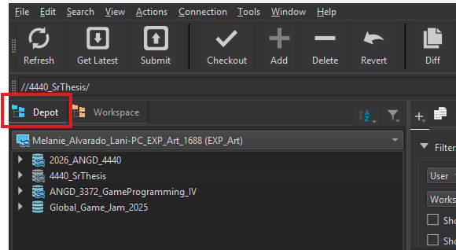
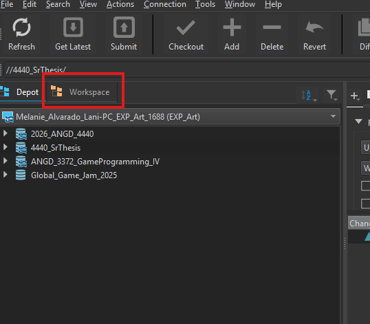
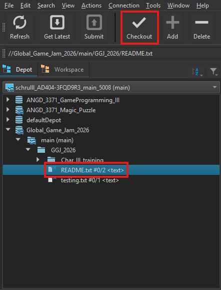

## Depot
A depot contains files stored on the Perforce server. The depot tab contains all depots that you have access to. Everything in this tab is what is on the Perforce Server.

1. In the Depot tab on the left, there will be every depot you have access to.

2. If the depot you are looking for is not present, then you do not have access. Contact Professor Li for access:

## Workspace
A workspace is a local copy of the files stored on the Perforce server. Everything in this tab comes from the depot unless you add new files, change an existing file, or delete files. In which case, you need to push your new files from your computer to the server.

1. Click the "Workspace" tab to see what workspaces are on your computer:
 

 ## Checking out Files

 Files must be checked out before working on them. This prevents conflicts that arise from two people working on the same file at once.

 1. To check out a file, make sure the correct file is selected from the depo, then click check out at the top. Files will automatically be checked back in once you submit your changes to the server.

 

 ## Streams

 The stream graph can be opened from View > Stream Graph