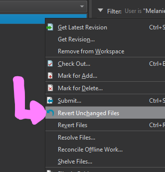
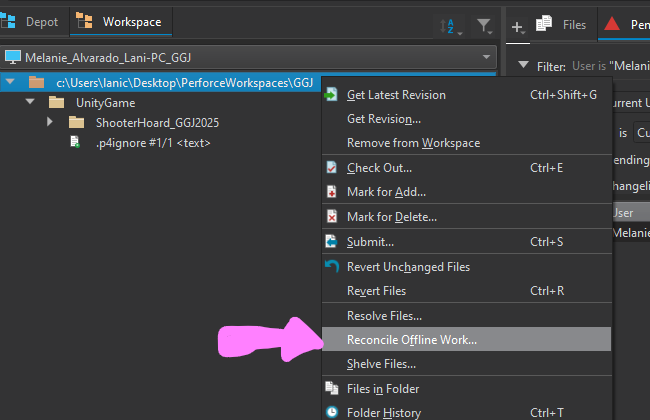
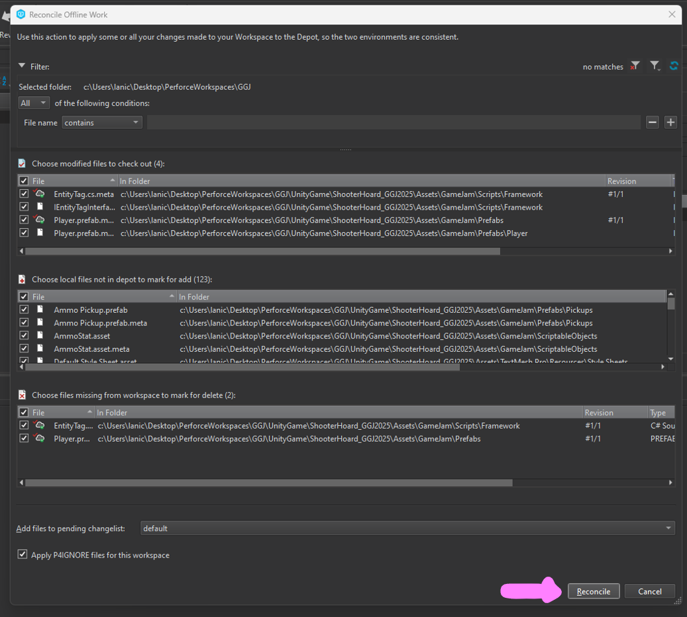
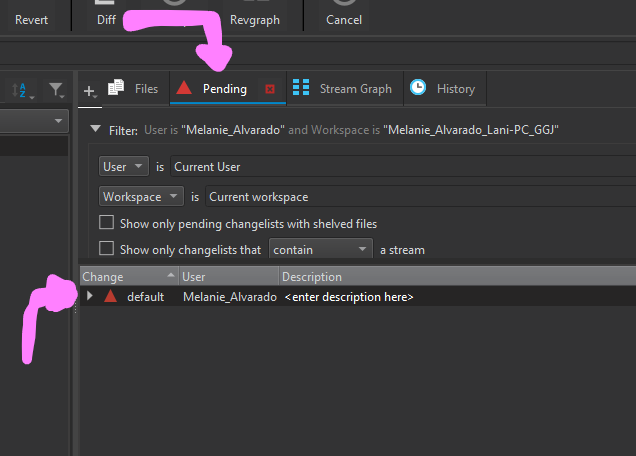
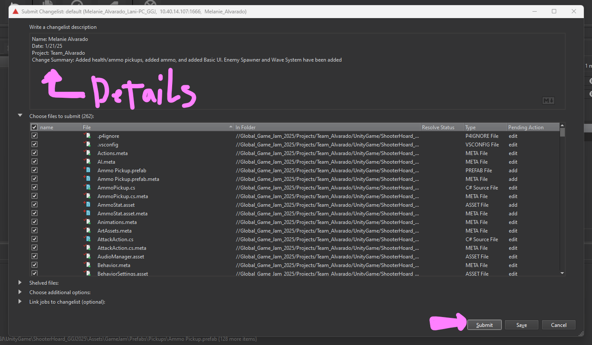
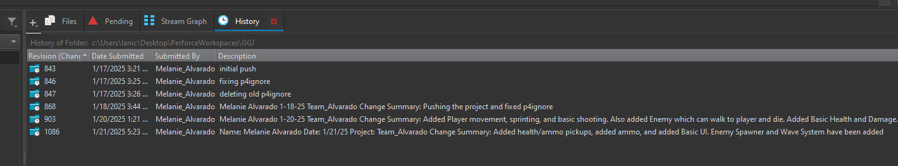

# General Workflow 
Thanks to contribution of Melanie
### To push your work to perforce
 1, First, we need to get the recent version of the perforce project. Inside the ```Workspace``` tab, select the top file with your filepath:

 

2, Then click the ```Refresh``` button on top (to update the depot), and the "Get Latest" button (to update your workspace) 


****
 <span style="color:red"> **3. Be sure to have a copy of your work before this!**</span>
 
 Right click your top folder again, find and click ```Revert Unchanged Files```. Then, click ```Reconcile Offline Work.```

 

 

4. In the pop-up, double check if the correct files are being added, removed, or changed (+ symbol is added, x symbol means delete). Once you are certain all is good, hit ```reconcile``` at the bottom-right.



5, Now, go to the ```Pending``` tab and double-click the red triangle ```default```.



6, double-check files being changed ("+" is add, "x" is delete). Be sure to add details (Name, Date, project, and change summary) to your Changelist. Once you are certain everything is fine (and won't delete work by accident), typing in some notes in the details, and hit ```submit```. 



7. Your work should be on the depot by now, but just in case, you can go to the "History" tab and see if your Revision (changes) are there.

