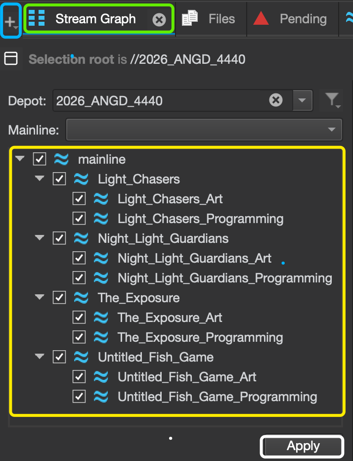
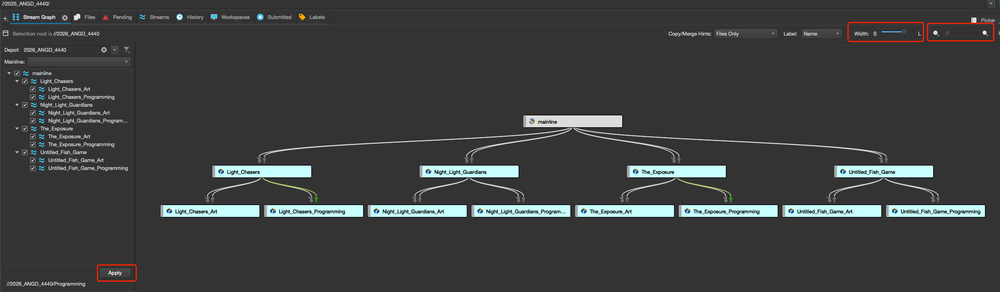
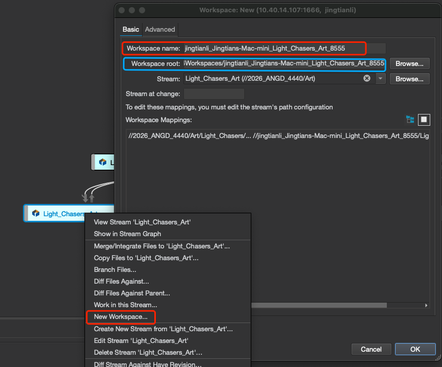
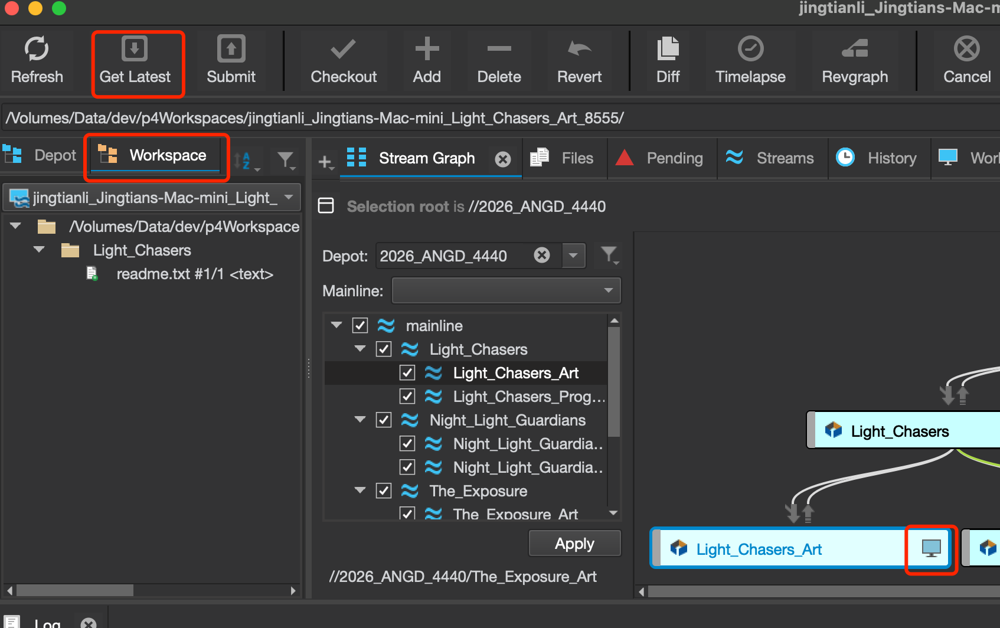
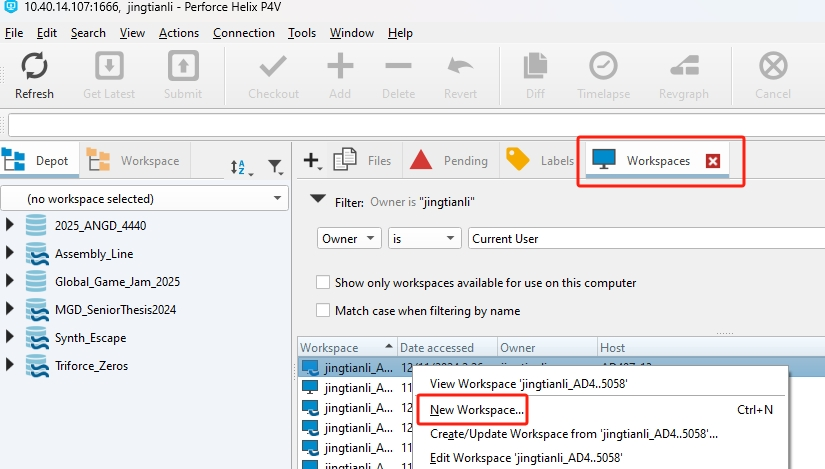
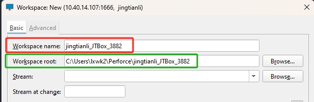
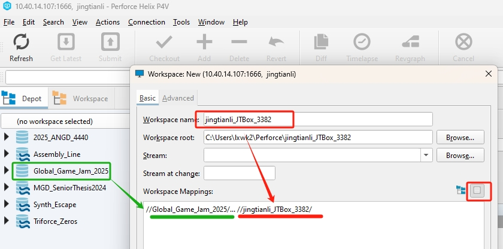
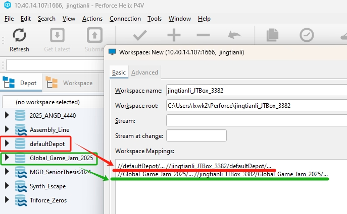
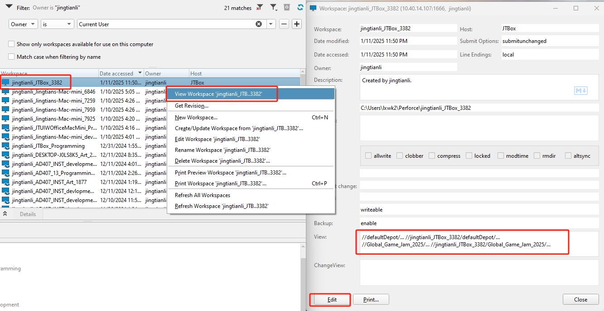

# Making the Workspace

A workspace is a local directory(folder) on your computer that maps to a portion of the server so you can work on that portion on your computer, sync, and update with it.

Before we jump in to making a workspace, let's quickly look at the structure of a perforce server:

### Depots
On the very top level, the server is a collection of ```depots```, you can think of a ```depot``` as a folder on the server. A ```depot``` can contain a single project, or a collection of multiple projects, it really is up to the studio to determine how they want to structure their projects. 


The above image shows the depots that is currently on our server. The ```2026_ANGD_4440``` is a ```depot``` that has all the thesis projects in it. In contrast, the ```Assembly_Line``` is a ```depot``` that is a single project.

There are 2 common types of depots, the ones with the 2 curly lines in their icon are ```stream depots```, the ones without are local ```depots```. 

The ```stream depot``` are recommend for better and controlled structure. In the image above, the ```Global_Game_Jam_2025``` is a local depot, and the ```MGD_SeniorThesis2024``` is a stream depot. Only the users with admin access can create depots.

a ```local depot``` only has a tradional folder structure, while a ```stream depot``` has folder structures that are managed by ```streams```.

### Streams
a ```stream``` are conceptually an isolated portion of a ```depot``` a contributer can work with.

It has the following functionalities:

* Defines what directories(folders) on the server will you be working on
* Defines how the directories in the stream contributes to and interacts with the whole depot

The following image shows the structure of the ```2026_ANGD_4440``` is composed of ```streams``` and their child ```streams```, to view the stream structure of a stream depot, go to the ```Stream Graph``` tab, and selected the depot you want to view in the ```Depot``` drop down list:



In this case, the mainline stream on the very top level is the entire depot. and it is composed of the 4 ```streams``` each represent a project:

* Light Chasers
* Night Light Guardians
* The Exposure
* Untitled Fish Game

Each of the 4 streams maps to an individual project. For example, the ```Light Chasers``` streams only maps to the folders/files of the Light Chasers project. We can call these 4 streams ```Project Streams```

Within each of the ```Project Stream```, there are 2 child streams:

* <project_name>_Art
* <project_name>_Programming

They are child streams of the project streams. the ```Art``` and ```Programming``` streams both are mapped to the entire folders/files of the project, the Art stream is meant for artist to use, and the progammers should use the programming stream. Ideally, the artists remain working in the ```Art``` stream, and the programmers remain working in the ```programming``` stream, and the manager of the team works in the ```project stream```. For example, if you are an artist working on the ```Light Chaser``` project, you would work in the ```Light_Chaser_Art``` stream. 

The 2 streams are like 2 "parallel universes", they are similar to the ```branch``` in a git repo. Both streams are child streams of the ```project stream```, they merge down the updates from the ```project stream``` and copy up their new changes to the ```project stream```, people in different streams do not interfer each other's work, and the ```project stream``` combines their work together.

If you check on the checker boxes of all the streams in the stream list, and press the apply button, you can then view the graph of the streams of the entire repos:

the stream graph shows the structure of the depot, and also the state of each of the stream.

### Stream Depot Workspace

A workspace in a ```stream depot``` is a local directory(folder) on your computer that syncs with a ```stream``` on the p4 server. What portion or portions of the server is synced to your directory is defined by the ```stream``` the workspace is linked to.

To create a workspace from a stream, just simply right click on the stream in the stream graph, and select ```New Workspace```:



In the pop up window, the ```Workspace name``` is the unique name of your workspace, by default, it is composed with ```username```+```ComputerName```+```RandomUniqueNumber```. You can give it a different name but it needs to be globally unique, and have good infomation like user name and the computer. Be aware that this workspace is recored on the server, and deleting the folder on your local computer will not remove that record. The ```Workspace root``` is the local root directory of the Workspace, it is where you have files synced with the server. Pick a good place you can easily find. 

The folders/files that your workspace will be syncronized with are predefined by the managing team, simple click on the ```OK``` button to create the workspace.

You should be automatically swithed to the new ```workspace```, go to the ```workspace``` tab, and click on the ```Get Latest``` button, and the files of the project should be downloaded for you to start working on:

Notice that there is a small monior icon apears on the stream your workspace is currently on. To see how to work with the stream workspaces, please go to [Work with Stream Workspaces](../Documentation/StreamWorkspaceWorkflow.md)


### For anyone who works on a local classic depot, here is how to create a workspace:
## Local Depot workspace

A workspace in a ```local depot``` is a local directory(folder) on your computer that syncs with a folder on the p4 server. What portion or portions of the server is synced to your directory is defined by the ```view```/```Mapping``` of the workspace. 
### To create a local depot workspace:
* In the ```Workspace``` tab, right click on any of the items in the workspace list, and click ```New Workspace```, if the ```Workspace``` tab do not exists, press ```Ctrl + 5``` to open it. you should also be able to find it under the ```Main Menu```->```View```.



The following popup window will show up:



* In the pop up window, the ```Workspace name``` is the unique name of your workspace, by default, it is composed with ```username```+```ComputerName```+```RandomUniqueNumber```. You can give it a different name but it needs to be globally unique, and have good infomation like user name and the computer. Be aware that this workspace is recored on the server, and deleting the folder on your local computer will not remove that record. The ```Workspace root``` is the local root directory of the Workspace, it is where you have files synced with the server. Pick a good place you can easily find. 

* You will then configure what part of the server are you going to sync in the ```Workspace Mappings``` section, I recommend you set to ```view workspace mapping as text```:


Configure the text below as:

```
//TheDepotYouWantToSyncWith/... //YourWorkSpaceName/
```

the first ```//``` means the root directory of the perforce server. the second ```//``` means your local machine. the ```/...``` means every file and subdirectories. The text above then translate as:

Everything under ```TheDepotYouWantToSyncWith``` on the ```Server``` syncs to the folder of ```YourWorkspace``` on your local machine.

for example, if you want to work on the depot ```Global_Game_Jam_2025```, you can then map it to your workspace by using the config (be aware that the workspace name part is suppose to be yours instead of the example one):

```
//Global_Game_Jam_2025/... //jingtianli_JTBox_3382/
```
The following image is showing such config:



Say we have 4 projects: A, B, C, D, each is a sub directory in the ```Global_Game_Jam_2025``` depot, and you are only working on Project A and don't care about the others. then your configuration will be:

```
//Global_Game_Jame_2025/A/... //yourWorkSpaceName/...
```
Notice that we added ```A/...``` Under the ```Global_Game_Jame_2025```, so we are only mapping the A subdiretory of the ```Global_Game_Jame_2025``` to your local workspace.

Another situation is that you are assigned to work on both A, and B, then what you can do is add 2 lines:
```
//Global_Game_Jame_2025/A/... //yourWorkSpaceName/A/
//Global_Game_Jame_2025/B/... //yourWorkSpaceName/B/
```
Notice that we will have to add ```A/...``` and ```B/...``` to your workspace to differenciate them. Also be aware that if you added some file to the folder ```YourWorkspaceName```, because that folder is not mapped to anything (Only the A and B subfolders are), the file will simply not be considered as new files.

And if you are wondering, yes, you can map multiple depots to multiple subfolders to a sinlge workspace, for example, a new dummy empty depot called defaultDepot is created, the configure in the following image maps both depot to the new workspace:



Or to put it simply, you can map any number of different parts of the server to your workspace.

* After you have configured your mapping (some times refer as view) of your workspace, I also recommend to check on ```Automatically get all revisions``` to get all the files you mapped to your workspace right away. if you do not check it on, your workspace will be empty. Click the ```OK``` button to finish creating your workspace.


* If you did something wrong or changed your mind, you can right click on the workspace you just created in the workspace list, and click ```View Workspace 'your work space name'```. In the pop up window, you can alter the settings(like the ```View```) of your workspace, and click the ```Edit``` button to make the change.



You should now be able to work on the project with the workspace. please check on the [General Workflow](../Documentation/GeneralWorkflow.md) for how to work with the files.
