# Stream Workspace Workflow

### General Workflow
Streams follow a very controlled hierarchical structure. consider the following stream structure for the demo GameProject:

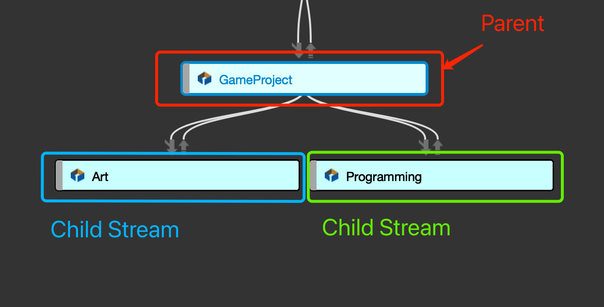

The ```GameProject``` stream is the parent stream of the ```Art``` stream and the ```Programming``` stream.

As you can see, the streams are designed for each displine for the whole project. The artists are expected to use the ```Art``` stream, and the the programmers will work in the ```Programming``` stream, the ```GameProject``` stream is the parent stream that both of the child streams contribute and synced with.

Let's say a modeler Adam is trying to work on the new model, Here is the general process:

* Adam would first create a ```workspace```(if he haven't already) from the ```Art``` Stream.

* Adam get all the revisions on his workspace just in case he is missing important update.

* Adam create the new model and save the file within the workspace.

* Adam mark the file for add and add it to a ```change list``` (a change list is a list of file changes recorded on the workspace and will be submitted to the server) 

* Adam submit the change list to the server, the ```Art``` stream now has the new model.

* Adam merge down the changes from the ```Game Project``` stream, and solve file change conflicts if there is any(file comflicts happens when 2 people alterted the same file, should be rare cases).

* Some one on the ```GameProject``` stream will then copy it up so that every one can have access to it. Adam can also switch to the ```GameProject``` stream to do it himself.

Let workthrough the steps described above with the ```StreamDemo``` depot:

```NOTE: Step 1 and 2 are only needed if you haven't created the workspace on the computer yet```

1, Open P4V, and open the ```Stream Graph``` panel, if can't find, you can go to the view menu to find it. In the ```Depot``` list, select the ```StreamDemo``` depot, check on only the ```GameProject``` and it's children in the tree view under, and click on the ```Apply``` button. Right click on the ```Art``` stream in the graph, and Select ```New Workspace...```
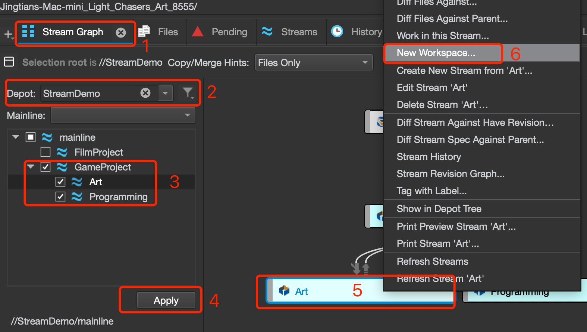

2, in the popup window, All you need to do is click on the ```Browse...``` button to set which directory will be used for the workspace. and press ```OK```

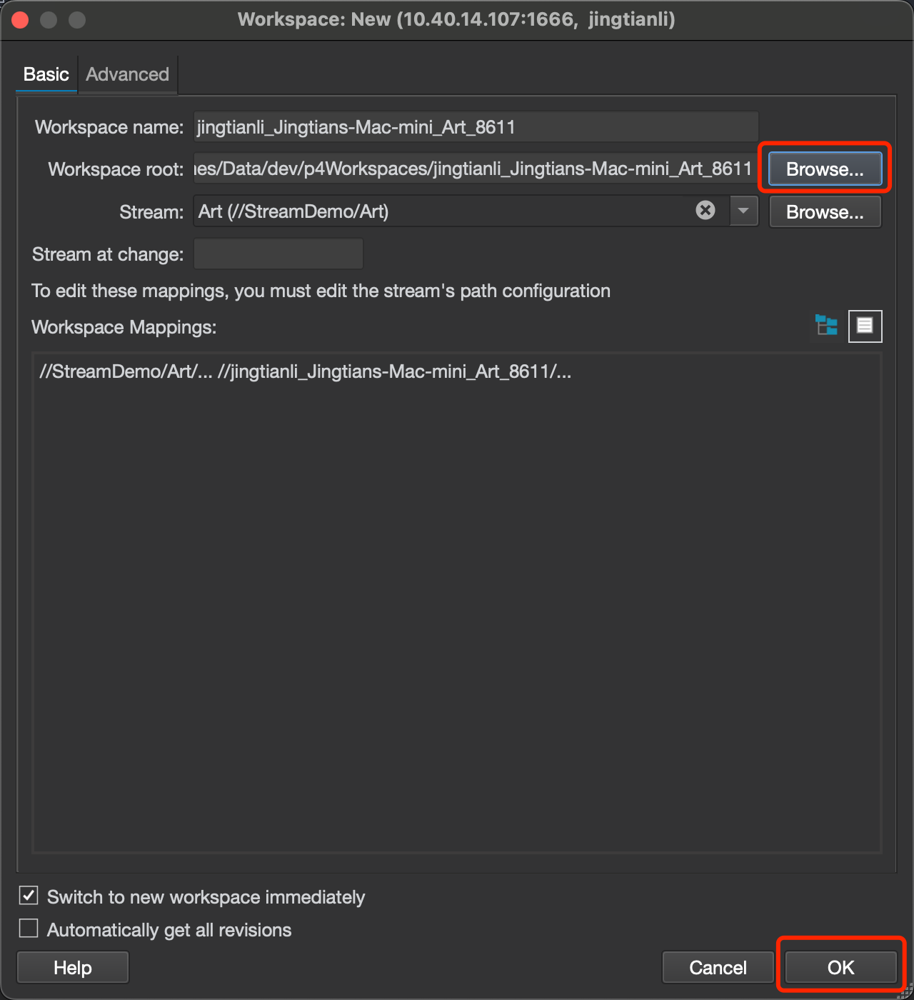

You will automatically switch to the new workspace, and there will be a monior icon showing on the ```Art``` stream, indicating that you current workspace is on that stream.

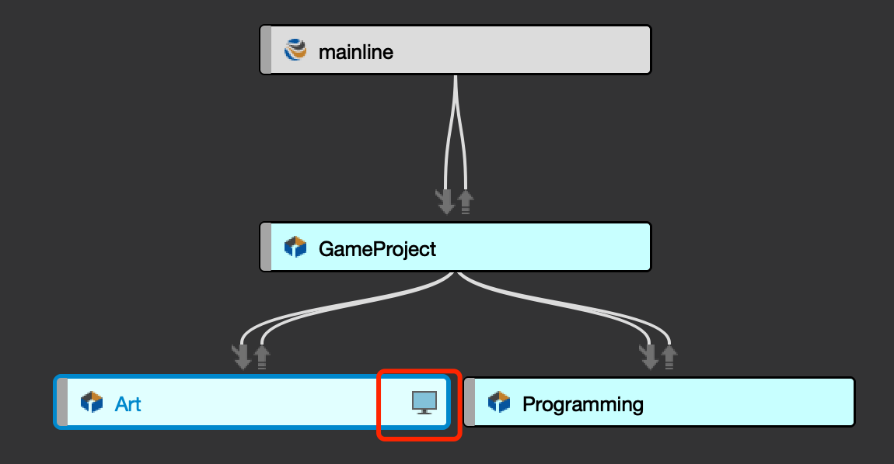

3, Go to the ```Workspace``` tab, and select the root of the file tree, and click on the ```Get Latest``` button to get the the files updated to their latest state, the folders/files should now apear in the tree view.

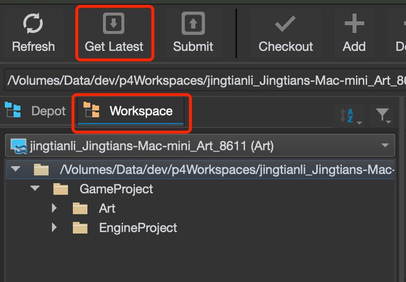

4, Add a maya file (Model.mb) to the Art folder, click on the refresh button in p4v, and the file should apear. Right click on the ```Model.mb``` file, and select ```Mark for Add...```

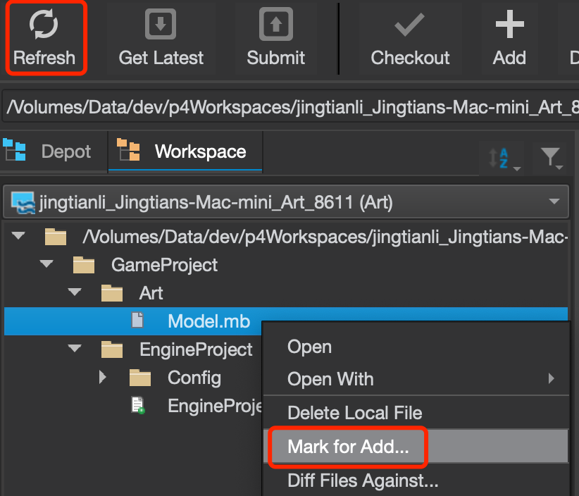

In the popup window, click on ```OK``` to add the file to the default changelist.

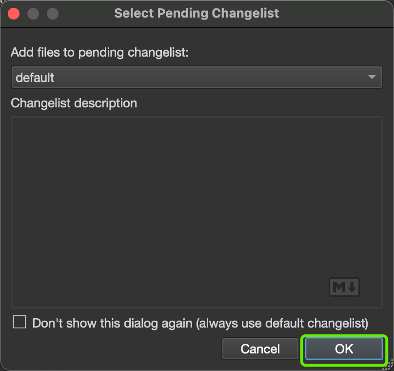

5, go to the ```Pending``` tab, select the ```default``` change list, and click on the ```Submit``` button, in the popup window, add some comment to describe what the change is, and click on the ```Submit``` button.

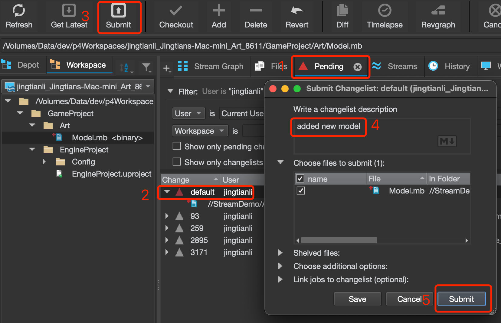

7, Go back to the stream graph, and observe the the current state of the streams:

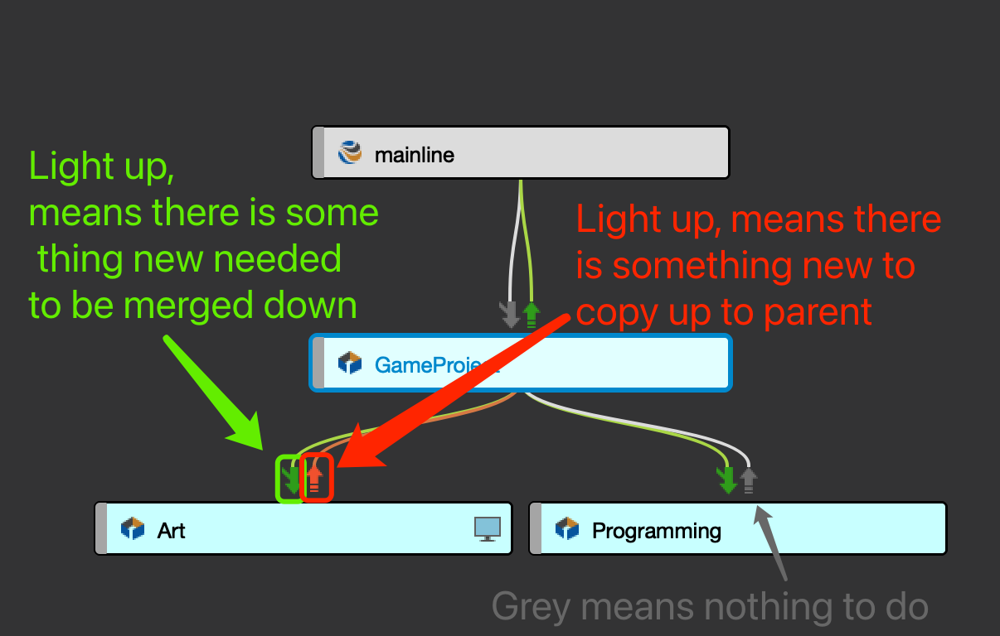

We can see that the green arrow from ```GameProject``` (parent) lights up, that means there is new update in the parent that needs to be merged down before you can copy up your new changes. the red arrow leading to ```GameProject``` also lights up, meaning that you do have new changes to be copied to the parent.

Perforce streams follows a very structured way for updates to flow, the new changes from the parent have to be merged down to the child before the child can copy up their changes back to the parent, or to put it simply a ```Merge Down - Copy Up``` workflow.

To change any perforce stream, you have to swith to that stream.For example, to merge down the changes from the parent to child(in this case the child is the one being updated/changed), you need to be on the child stream.To copy up from the child to the parent(in this case the parent is the one being updated/changed), you have to be on the parent stream.

Let's do the ```Merge Down - Copy Up``` workflow:

first,observe that the little monitor is on the ```Art``` stream, meaning we are on the art stream, this is good because we need to do ```Merge Down``` first on the ```Art``` stream.

double click on the ```Art``` stream, and click on the ```Merge``` changes. in the popup window, check on ```Automatically submit after resolving```, and click the ```Merge``` button.

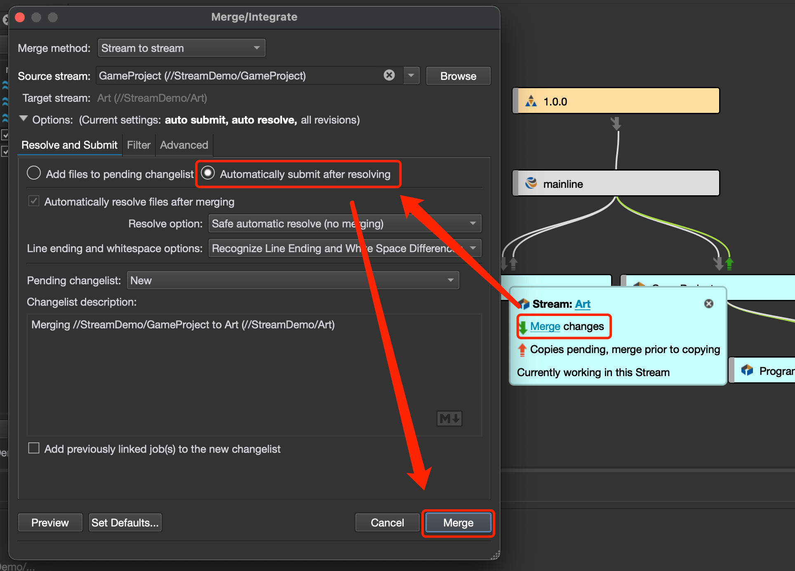

If the merge was successful without any merge conflicts, then you are all good, and should see that the merge down arrow grayed out, meaning you have nothing more to merge down:

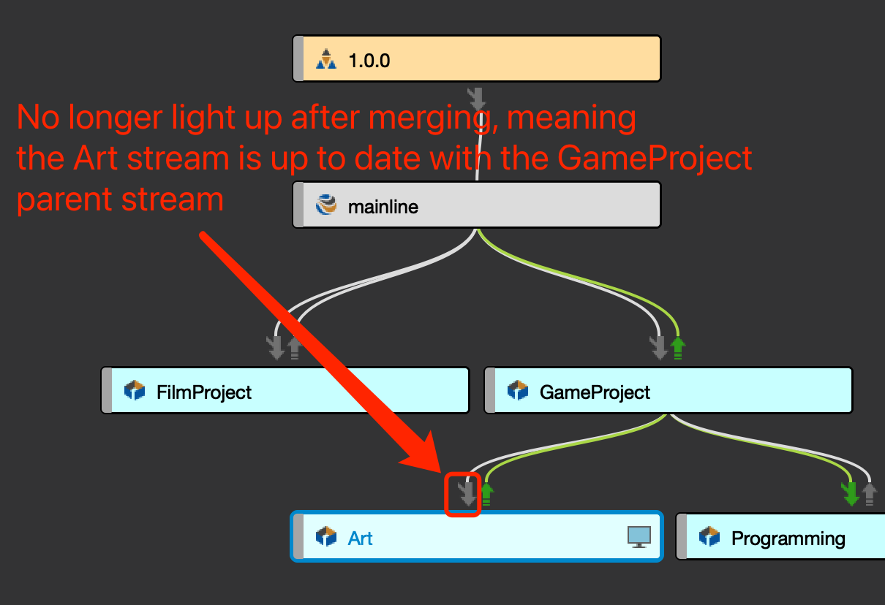

You should now have all the updated that has been added to the GameProject stream.

Now let's do the ```Copy Up```, because we need to copy up to the ```GameProject``` stream, the ```GameProject``` stream is the one being changed, we will need to switch to it by dragging the little monitor on the ```Art``` stream to the ```GameProject``` stream, when ased do you want to get the latest revision, click on the ```Yes``` button(other wise, you will need to redownload everything...), it may take a few seconds to make the change, wait for the minor icon to apear on the ```GameProject``` stream.

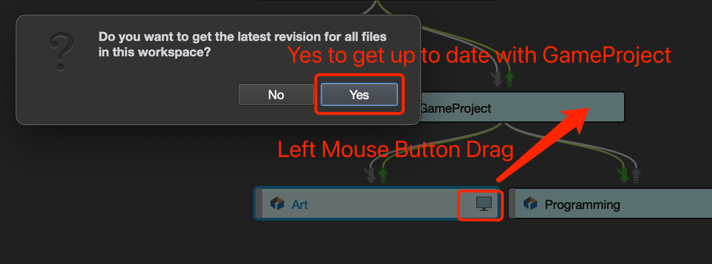

Double click on the ```Art``` stream again, and this time, press the ```Copy``` changes, in the pop up window, check on ```Automatically submit copied files``` again, and press the ```Copy``` button.

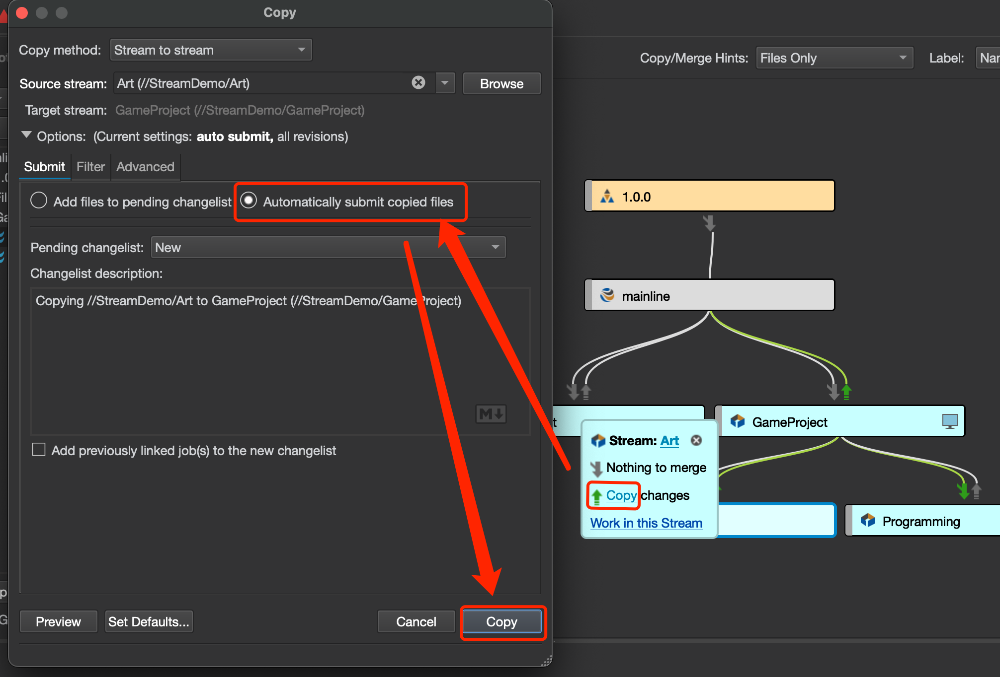

Because you have to do merge down first before copy up, there should not be a merge conflict, and all the arrows connecting to ```Art``` should gray out, indicating that there is nothing to update between streams. you can now drag the monitor back, and start working on another task:

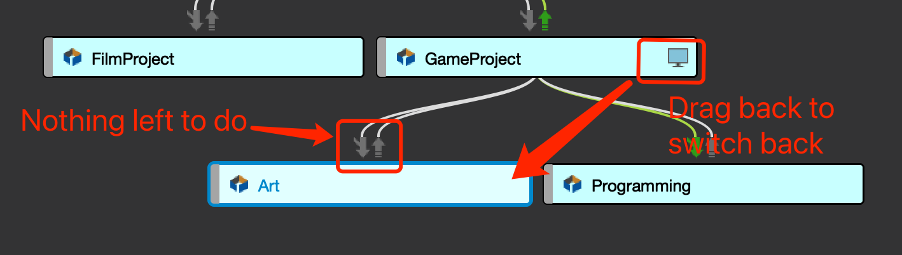

You can also merge changes from another stream that is not the parent, for example, if the programmers has done some coding work in the ```Programming``` stream, and it has not been copied up to the ```GameProject``` stream yet, but you need to test it in your ```Art``` stream, you can of course do the ```Merge Down - Copy Up``` workflow with the ```Programming``` stream, but that will need you to switch to both of the other 2 streams at least once. let's see how we can get the changes from ```Programming``` directly to Art:

first, right click on the ```Art``` stream, and select ```Merge/Integrate Files to 'Art'...```, in the pop up window, check on the ```Automatically submit after resolving``` as before, and click on the ```Browse``` button:

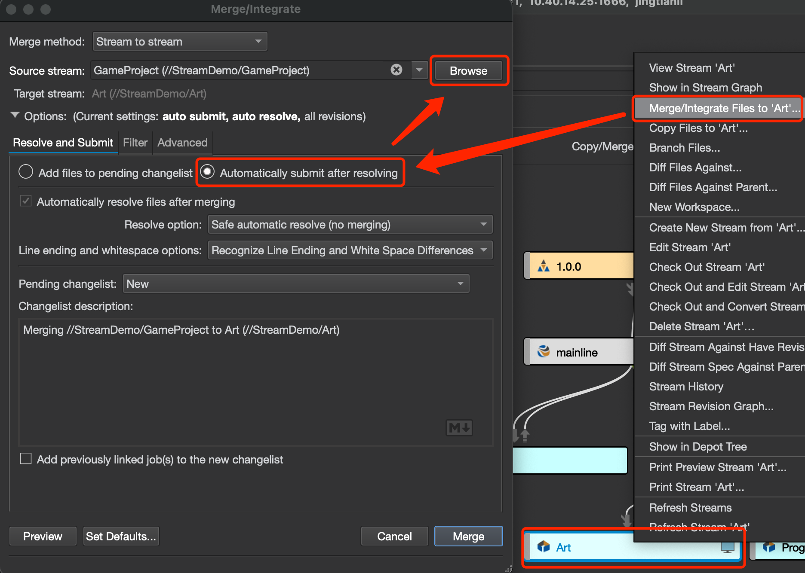

in the new pop up menu, click ```Display all streams```

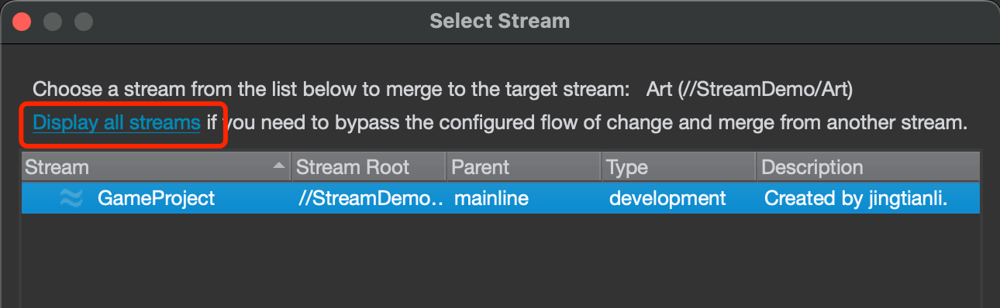

All the streams instead of just the parent should show up in the list of streams down below, select the ```Programming``` stream in the list, and click the ```OK``` button:

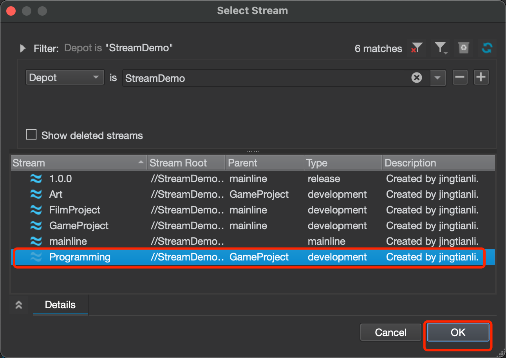

notice how the ```Source stream:``` is set to the ```Programming``` stream, click on the ```Merge``` button to finish the intergration:

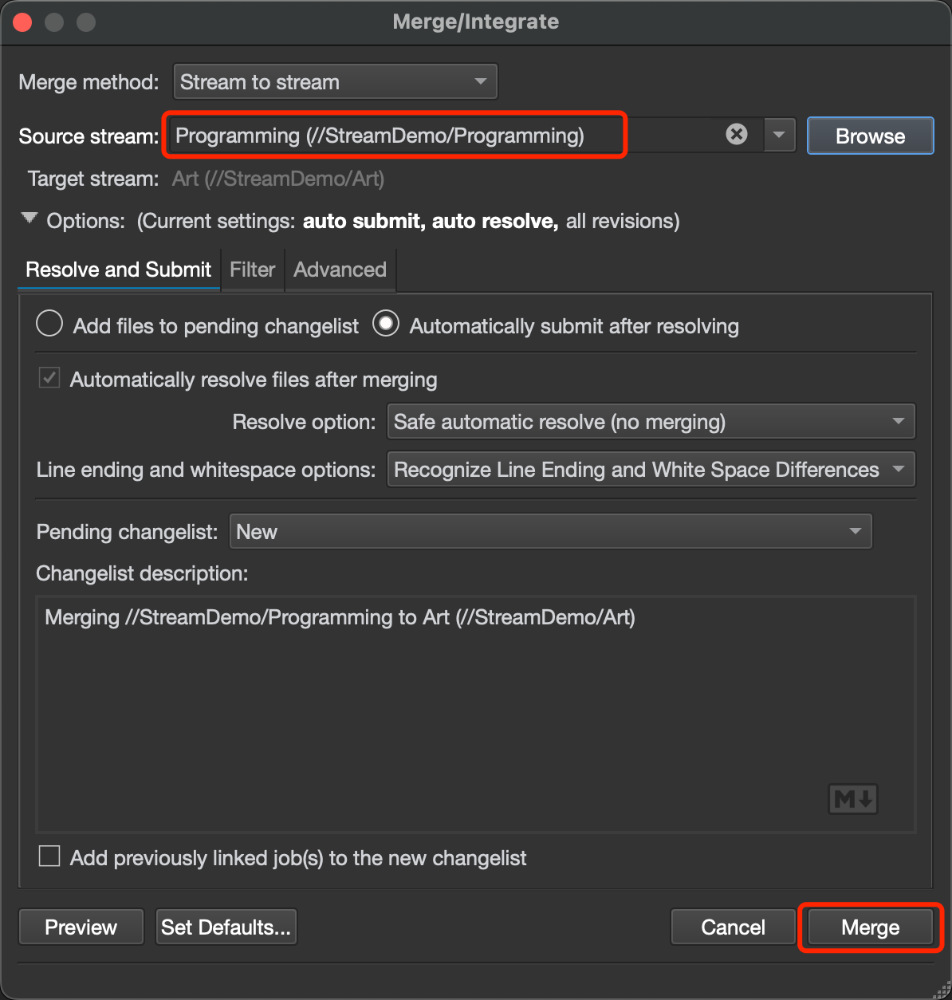

After the mering, if no conflict, then you will have all the new updates from the ```Programming``` stream to the ```Art``` stream.

When merging, there is a possibility that there is nothing new, then you will get this error, simply click on ok and nothing will happen:

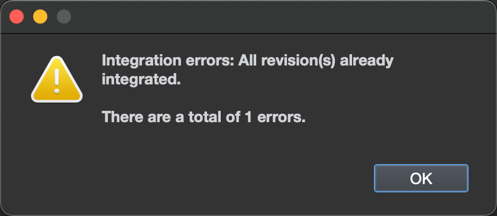

For general workflows with adding, removing, checkout, it should be the same as classic depots, see how to do these in here:

[General Workflow](../Documentation/GeneralWorkflow.md)