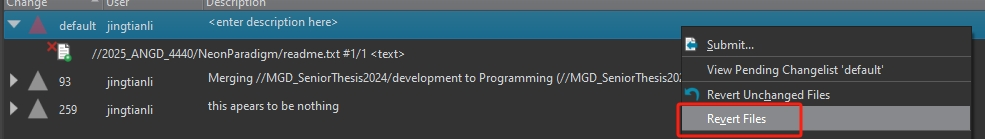
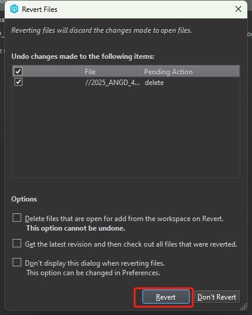

## Files Mark For Deletion
If files are marked for deletion and cannot be access elsewhere. here are some steps to fix it:
 
#### 1, Check Which User and Workspace did it.

* option 1: Hove the cursor on one of the files that are marked for deletion, and the tool tip should show who did it:


The above image shows that it's user ```jingtianli``` that marked it for deletion in workspace ```jingtian_JTBox_1464```

* option 2: Open Terminal, and type 
```sh
p4 opened -a //[Depot name]/[Sub Folder Name]/... | Select-String "delete"
```

this shows all(-a) files in the //[Depot Name]/[Sub Folder Name] folder that are marked for deletion (Select-String "delete")

for example:        


The example in the image aboe shows that user ```jingitanli``` has marked the file ```readme.txt``` for deleteion in the default changelist in the workspace named: ```jingtianli_JTBox_1464```


#### 2, Clear the mark for deletion state
If you do not have Admin access, you will need to ask the user to do it on their end, the user has to go to their workspace, find the changelist, and right click on it, and select ```Revert Files```:



And then confirm the revert:



If the user do not have the workspace or do not have access to the workspace, the user who is resposible need to use terminal command to do it remotely:

```sh
p4 revert -k -C [Workspace Name] //[Depot Name]/[Sub Folder Name]/...
```
The ```-k``` means we will keep the file changes on that workspace, we are just removing the state, the ```-C``` means we want to specify the client(Workspace) we want to operate on, if not specified, your current workspace will be used.

The following image shows an example of using the terminal to clear the delete state of all files in ```2025_ANGD_4440/NeonParadigm/``` that was makred for deletion in the workspace named ```jingtianli_JTBox_1464```:


The output of the command shows that ```readme.txt``` was in delete state, and now that state is cleared.

If the user do not exist, or you cannot get a hold of that user, an admin can used the same terminal command to clear the delete state. All ANGD fulltime facult have admin access.