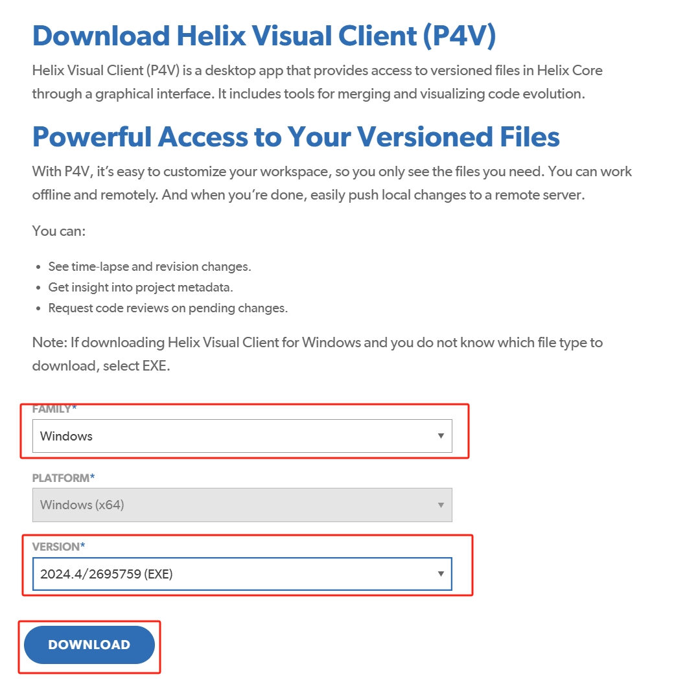
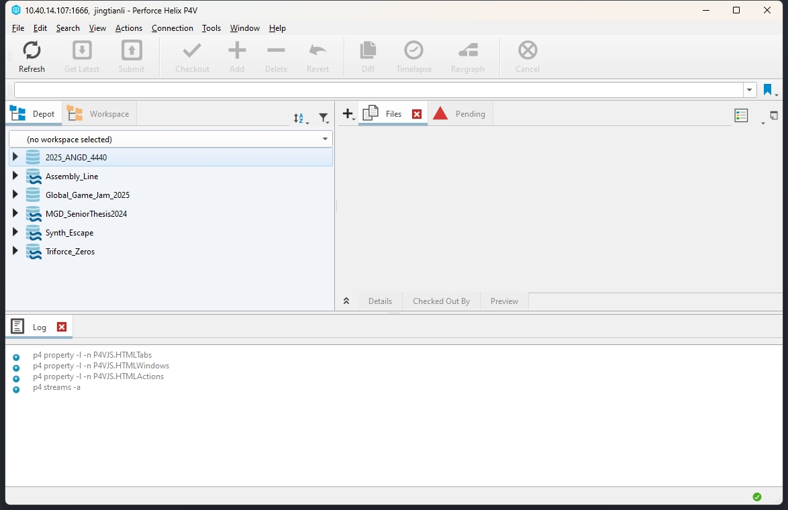
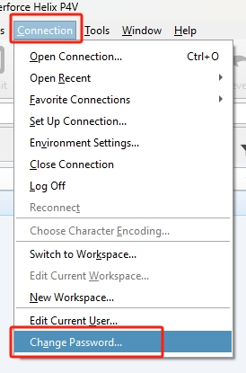
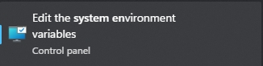
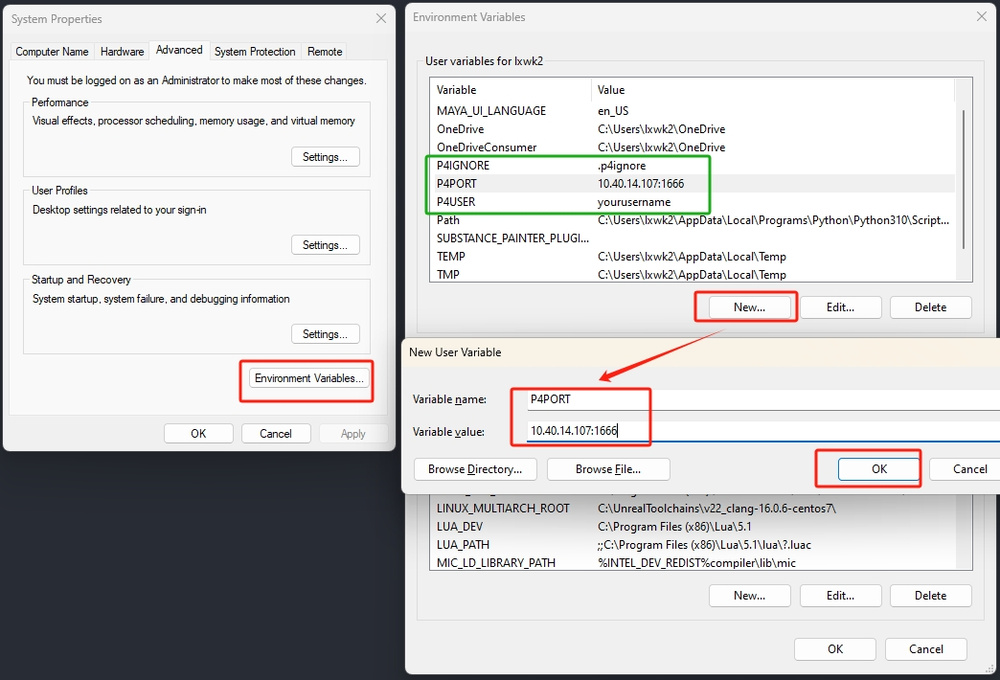

# Perforce Server Documentation

### Userful Topics:

- [Environment Variable](Documentation/SystemVariable.md)

- [P4IGNORE](Documentation/P4Ignore.md)

- [Making a Workspace](Documentation/MakingWorkspace.md)


- [Working with Streams](Documentation/streamWorkspaceWorkflow.md)

- [General Workflow](Documentation/GeneralWorkflow.md)

- [Perforce Official Tutorial](https://www.youtube.com/watch?v=jIQEjDiSe0g&list=PLH3pq2J85xsPYn71_yzzsZQKvalTW-duE)

- [Issues](Documentation/Issues.md)

- [Add New Project Folder](Documentation/AddBrandNewProject.md)

- [Back Up Routine](Documentation/BackingUpRoutine.md)

- [Working From Home](Documentation/WorkingFromHome.md)

- [Adminastrations](Documentation/Admin.md)

- [Configure New Server](Documentation/ServerConfiguration.md)

- [For Programmers](Documentation/ForCoders.md)

# Quick Start For Users

```Note:```To access our P4 server outside the Labs, you will need [VPN Access](Documentation/WorkingFromHome.md).

```Your User Name:``` Your user name should be the same as the local part of your email, if your email is ```abcde@uiwtx.edu```, your user name is ```abcde```, if you belive you don't have an account, contact your faculty to add one for you.

### Setup P4 Client
* Download ```Perforce Visual Client``` from [here](https://www.perforce.com/downloads/helix-visual-client-p4v). Make sure you select ```Windows```(or ```MacOS``` if you are using Mac), and the latest version. And click the ```DOWNLOAD``` button.




* Launch the Downloaded installer, in the first settings, check on all four, use detault install directory, and click ```Next```.


* In the next page, make sure the ```Server``` Setting is ```10.40.14.25:1666```. And the ```User Name``` is set to be your user name. Click on ```Next```, and then Click on ```Install```

```Note that the image shows the server as 10.40.14.107:1666, that is an old ip address, use 10.40.14.25:1666```


* Launch ```P4V```, the Perforce Visual Client if it does not automatically open after the installation. In the ```Server``` setting, make sure it is configured as ```10.40.14.107:1666``` if it is not already, and set the ```User``` to be your user name. Leave the Workspace Empty. And Click the ```OK``` button.


* The ```Perforce Visual Client``` should now be launched as shown in the image:




* If this is the first time you login, there is no password set for your. You should ```ALWAYS``` add your password, to do so, go to the ```Main Menu```->```Connection```->```Change Password...```.



* You should setup some of the important environment variables so your system knows what your default configuration is.

    1, Press the ```Start``` Button, and search for ```Environment Variable``` find and launch the ```Edit the system envrionment``` option:

    

    2, In the ```System Properties``` window, click ```Environment Variables...``` and in the pop up window, click the ```New``` Button. and in the new pop up window, set the ```Variable name``` to ```P4PORT``` and ```Variable value``` to ```10.40.14.107:1666```. Click the ```OK``` button to add the variable. Perfore will try to find this environment variable to use as the port (the adress to connect to the server). You should also add the following envrionment variables:

    |  Variable Name | Variable Value |
    |----------------|----------------|
    | P4IGNORE       | .p4ignore      |
    | P4USER         | Your User Name |

    

    The [P4GINORE](Documentation/P4Ignore.md) is ```VERY IMPORTANT```, it tells perforce what files to not track and sync with the server, for both ```Unity``` and ```Unreal Engine```, there are a lot of generated files that are both re-generatable and super elaborate to keep track of and syncronize. 

    If you are a programmer, the .p4ignore servers the same purpose as .gitignore. But they work very differently, .gitignore is for the repos, but the .p4ignore is per client, you have specifically setup the ```P4IGNORE``` system varible on each of the machine you want to use the .p4ignore, it will not funcion if the environment variable is missing.


* For General Usage of Perforce, Watch this Tutorial:
[Perforce Official Tutorial](https://www.youtube.com/watch?v=jIQEjDiSe0g&list=PLH3pq2J85xsPYn71_yzzsZQKvalTW-duE)